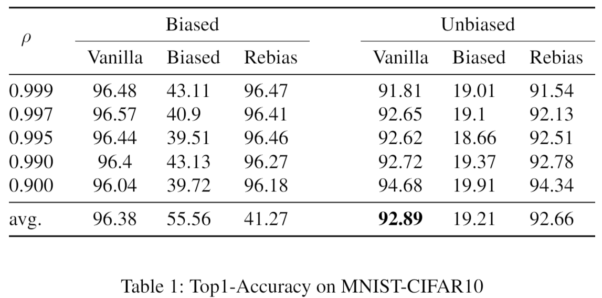
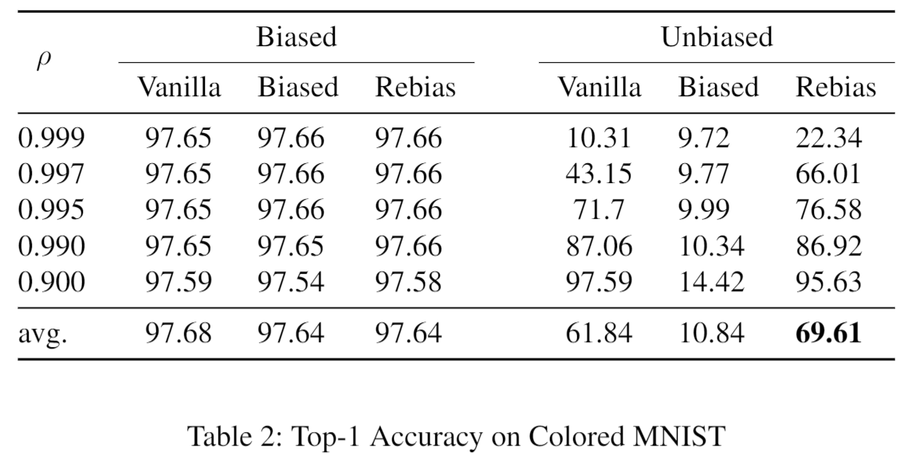
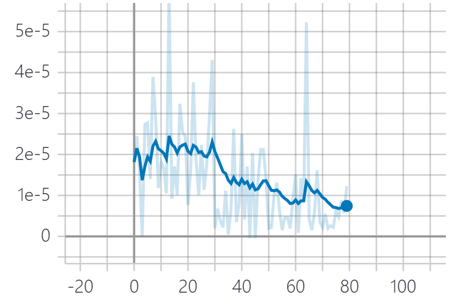

# Benchmark

Quantitative comparison (Top-1 Accuracy) between Rebias and its baselines and its Analysis

## Experimental Setup
### Models
* Rebias, Vanilla, Biased

### Training
* Train Dataset: MNIST-CIFAR10 dataset with rho = 0.999, 0.997, 0.995, 0.99, 0.9 ```--rho 0.999```
* Opimizer: AdamP ```AdamP(model_f.parameters(), lr=args.lr, betas=(0.9, 0.999), weight_decay=1e-2)```
* Learning Rate: ```--lr 0.001```
* Learning Rate Scheduling: ```lr_scheduler.StepLR(optimizer, step_size=20, gamma=0.1)```
* HSIC kernel type: ```--kernel_type 1```

### Evaluation
* Test Dataset: Biased Set (same rho with train set), Unbiased Set (rho = 0.1)
* Top-1 Accuracy
* HSIC Learning Curve

### Additional Experiments on Colored-MNIST dataset (taken from the original implementation repository)
This experiment is done as a sanity check of our implementation on the existing datasets in the original repository. Except colored-MNIST dataset and dataloader, every pipeline including model architecture and objective functions are solely implemented by me. 

* Train Dataset: Colored-MNIST dataset with rho = 0.999, 0.997, 0.995, 0.99, 0.9 ```--rho 0.999```
* Test Dataset: Biased Set (same rho with train set), Unbiased Set (rho = 0.1)
* Top-1 Accuracy

## Quantitative Results
### Top1 Accuracy on MNIST-CIFAR10 and Colored-MNIST



### Colored-MNIST
As seen in the Table 2, Vanilla, Biased and Rebias demonstrate the accuracies similar to those reported in the original paper. While Vanilla achieves nearly 97% accuracies on the biased dataset, its accuracies drastically drop on the debiased dataset (90% accuracy decrease in rho=0.999). This represents that Colored MNIST contain correlation between color and MNIST label, which encourages the model to rely on spurious attributes for classification. Fortunately, the proposed model, Rebias, has tackled this issue and outperformed Vanilla with remarkable gap on every correlation except for rho=0.99 and rho=0.9.

#### MNIST-CIFAR10
As shown in the Table 1, while Vanilla achieves nearly 96% of accuracy on biased datasets regardless of their correlation, it presents lower scores, i.e. average 92% on unbiased datasets. This performance gap demonstrates that in some degree, Vanilla learns a biased representation from the MNIST-CIFAR10 dataset and the degree increases as the correlation becomes severe (5% accuracy decrease). However, unlike in the Colored-MNIST setting, Rebias shows incremental improvement in the test accuracy compared to the Vanilla, and Vanilla outperforms Rebias in an average score.

### Learning Curve of HSIC


### Analysis
To better understand the reason of this disappointing result, in-depth analysis both on accuracies of Biased and on HSIC learning curve is required. First of all, Biased model's accuracy gap between biased and unbiased setting is large compared to other baselines, indicating that this model is specialized at capturing the bias inherent in the dataset. This is mainly due to its architectural design, i.e. restricted size of receptive field. 
Recall that HSIC regularization encourages Rebias (F) to learn de-biased representation by increasing independency from biased representation captured by G. However, as seen in the Figure (Learning Curve of HSIC), HSIC score is close to 0 even in the first epoch, and HSIC score does not contribute to the objective functions after wards. This phenomenon is significantly different from that in the Colored-MNIST, where HSIC slowly drops until 20 epochs in the training phase. 
Constrast to the Colored-MNIST where target bias (color) can be fully captured by the biased model (G), MNIST-CIFAR10 dataset contains high-level bias as well. Specifically, as the semantic concept such as airplane is highly correlated with digit number and this type of bias is not easily captured by the model designed with restricted receptive field. In this respect, we can assume that G merely captures the low-level bias such as blue sky color frequently emerging along with the airplane, but it cannot learn the bias with high-level concept. Therefore, de-biasing the high-level correlation from the F via G is not available in the current setting. To better tackle this difficult-to-define high-level bias, debiasing module with dffierent type of architecture beyond the simple texture-oriented network seems essential. 

## Note
Most of the implementation details are referred from the original Rebias paper.
